

Learn how to install blendOS on your computer through this guide!

## What you'll need

* A 64-bit CPU, from no earlier than 2009.
* A minimum of 4 GBs of RAM and 25 GBs of storage.
* A spare USB drive, with a minimum size of 4GBs.

<!--truncate-->

## Installation

You can skip to a particular step from the outline on the right, if you're on a computer.

### Step 1: Download the latest blendOS ISO file

:::tip

If you're coming from Windows or macOS, it's recommended that you download the [**KDE Plasma**](https://kde.org/plasma-desktop/) edition of blendOS. It is extremely intuitive, and has a similar workflow to other operating systems.

However, if you prefer a functional default layout and are open to something new, the [**GNOME**](https://www.gnome.org/) edition may be for you.
:::

:::danger

**Warning about downloads:**

The links below are the only certified places to get the ISO, **DO NOT DOWNLOAD IT FROM ANYWHERE ELSE!**

**Warning about torrents:**

FossTorrents is the only certified provider of blendOS torrents, do not torrent blendOS from anywhere else, **DO NOT USE ANY NON-FOSSTORRENTS TORRENTS.** If someone says they're mirroring the fosstorrents torrent, get the torrent from fosstorrents [**directly.**](https://fosstorrents.com/distributions/blendos/)
:::

1. KDE Plasma Edition:
    * ~~[Download from Google Drive (Broken ISO) (**DO NOT USE**)](https://drive.google.com/file/d/1SOTy4MCB_n_28Vm8-ZNbgxLOR9LV0ZMc/view)~~
    * [Download from SourceForge](https://sourceforge.net/projects/blendos/files/23.04-1/Plasma/blendOS-2023.04.22-x86_64-plasma.iso/download)
    * [Download from MEGA](https://mega.nz/file/2ExDkZQD#BIZ0ANkPdPMytkjqhQNaFLNca9T-BOa0DFbSYv_Y84c)
    * [Download from Asterisk's backup mirror (slow)](https://blend.shinken.studio/blendOS-2023.04.22-x86_64-plasma.iso)
    * [Download from](http://paid-01.pluoxhost.xyz:4006/blendOS-2023.04.22-x86_64-plasma.iso) [**PluoxHost**](https://pluoxhost.xyz) [mirror](http://paid-01.pluoxhost.xyz:4006/blendOS-2023.04.22-x86_64-plasma.iso)
    * [Download from SvGaming mirror](https://svgaming.serveo.net/downloadzone/blendos_mirror/blendOS-2023.04.22-x86_64-plasma.iso)
2. GNOME Edition:
    * ~~[Download from Google Drive (Broken ISO) (**DO NOT USE**)](https://drive.google.com/file/d/1nT_lMZlVy2y6VVJUas1qph4I7-gxsMfB/view)~~
    * [Download from SourceForge](https://sourceforge.net/projects/blendos/files/23.04-1/GNOME/blendOS-2023.04.22-x86_64-gnome.iso/download)
    * [Download from MEGA](https://mega.nz/file/eYAkRRwR#ogEFqh7ls08cis7EqjlGFdvqELtPoxUtqG7EN6pIqCc)
    * [Download from Asterisk's backup mirror (slow)](https://blend.shinken.studio/blendOS-2023.04.22-x86_64-gnome.iso)
    * [Download from](http://paid-01.pluoxhost.xyz:4006/blendOS-2023.04.22-x86_64-gnome.iso) [**PluoxHost**](https://pluoxhost.xyz) [mirror](http://paid-01.pluoxhost.xyz:4006/blendOS-2023.04.22-x86_64-gnome.iso)
    * [Download from SvGaming mirror](https://svgaming.serveo.net/downloadzone/blendos_mirror/blendOS-2023.04.22-x86_64-plasma.iso)
  
3. BitTorrent:
   * [blendOS FossTorrents homepage](https://fosstorrents.com/distributions/blendos/) (for .torrent files)
   * [KDE Magnet Link (FossTorrents)](magnet:?xt=urn:btih:a5a1a5a3ba8f646fa442fd17fbf971014f33d169&dn=blendOS-2023.04.22-x86_64-plasma.iso&tr=udp%3A%2F%2Ftracker.opentrackr.org%3A1337%2Fannounce&tr=udp%3A%2F%2Ffosstorrents.com%3A6969%2Fannounce&tr=http%3A%2F%2Ffosstorrents.com%3A6969%2Fannounce&tr=udp%3A%2F%2Ftracker.openbittorrent.com%3A6969%2Fannounce&tr=http%3A%2F%2Ftracker.openbittorrent.com%3A80%2Fannounce&tr=udp%3A%2F%2Ftracker.torrent.eu.org%3A451%2Fannounce&ws=https%3A%2F%2Fmaster.dl.sourceforge.net%2Fproject%2Fblendos%2F23.04-1%2FPlasma%2FblendOS-2023.04.22-x86_64-plasma.iso&ws=https%3A%2F%2Faarnet.dl.sourceforge.net%2Fproject%2Fblendos%2F23.04-1%2FPlasma%2FblendOS-2023.04.22-x86_64-plasma.iso&ws=https%3A%2F%2Fcitylan.dl.sourceforge.net%2Fproject%2Fblendos%2F23.04-1%2FPlasma%2FblendOS-2023.04.22-x86_64-plasma.iso&ws=https%3A%2F%2Fcolocrossing.dl.sourceforge.net%2Fproject%2Fblendos%2F23.04-1%2FPlasma%2FblendOS-2023.04.22-x86_64-plasma.iso&ws=https%3A%2F%2Fcznic.dl.sourceforge.net%2Fproject%2Fblendos%2F23.04-1%2FPlasma%2FblendOS-2023.04.22-x86_64-plasma.iso&ws=https%3A%2F%2Fdfn.dl.sourceforge.net%2Fproject%2Fblendos%2F23.04-1%2FPlasma%2FblendOS-2023.04.22-x86_64-plasma.iso&ws=https%3A%2F%2Ffreefr.dl.sourceforge.net%2Fproject%2Fblendos%2F23.04-1%2FPlasma%2FblendOS-2023.04.22-x86_64-plasma.iso&ws=https%3A%2F%2Fgarr.dl.sourceforge.net%2Fproject%2Fblendos%2F23.04-1%2FPlasma%2FblendOS-2023.04.22-x86_64-plasma.iso&ws=https%3A%2F%2Fheanet.dl.sourceforge.net%2Fproject%2Fblendos%2F23.04-1%2FPlasma%2FblendOS-2023.04.22-x86_64-plasma.iso&ws=https%3A%2F%2Fhivelocity.dl.sourceforge.net%2Fproject%2Fblendos%2F23.04-1%2FPlasma%2FblendOS-2023.04.22-x86_64-plasma.iso&ws=https%3A%2F%2Fignum.dl.sourceforge.net%2Fproject%2Fblendos%2F23.04-1%2FPlasma%2FblendOS-2023.04.22-x86_64-plasma.iso&ws=https%3A%2F%2Finternode.dl.sourceforge.net%2Fproject%2Fblendos%2F23.04-1%2FPlasma%2FblendOS-2023.04.22-x86_64-plasma.iso&ws=https%3A%2F%2Fiweb.dl.sourceforge.net%2Fproject%2Fblendos%2F23.04-1%2FPlasma%2FblendOS-2023.04.22-x86_64-plasma.iso&ws=https%3A%2F%2Fjaist.dl.sourceforge.net%2Fproject%2Fblendos%2F23.04-1%2FPlasma%2FblendOS-2023.04.22-x86_64-plasma.iso&ws=https%3A%2F%2Fkaz.dl.sourceforge.net%2Fproject%2Fblendos%2F23.04-1%2FPlasma%2FblendOS-2023.04.22-x86_64-plasma.iso&ws=https%3A%2F%2Fkent.dl.sourceforge.net%2Fproject%2Fblendos%2F23.04-1%2FPlasma%2FblendOS-2023.04.22-x86_64-plasma.iso&ws=https%3A%2F%2Fnchc.dl.sourceforge.net%2Fproject%2Fblendos%2F23.04-1%2FPlasma%2FblendOS-2023.04.22-x86_64-plasma.iso&ws=https%3A%2F%2Fncu.dl.sourceforge.net%2Fproject%2Fblendos%2F23.04-1%2FPlasma%2FblendOS-2023.04.22-x86_64-plasma.iso&ws=https%3A%2F%2Fnetcologne.dl.sourceforge.net%2Fproject%2Fblendos%2F23.04-1%2FPlasma%2FblendOS-2023.04.22-x86_64-plasma.iso&ws=https%3A%2F%2Foptimate.dl.sourceforge.net%2Fproject%2Fblendos%2F23.04-1%2FPlasma%2FblendOS-2023.04.22-x86_64-plasma.iso&ws=https%3A%2F%2Fskylink.dl.sourceforge.net%2Fproject%2Fblendos%2F23.04-1%2FPlasma%2FblendOS-2023.04.22-x86_64-plasma.iso&ws=https%3A%2F%2Fsoftlayer-ams.dl.sourceforge.net%2Fproject%2Fblendos%2F23.04-1%2FPlasma%2FblendOS-2023.04.22-x86_64-plasma.iso&ws=https%3A%2F%2Fsoftlayer-dal.dl.sourceforge.net%2Fproject%2Fblendos%2F23.04-1%2FPlasma%2FblendOS-2023.04.22-x86_64-plasma.iso&ws=https%3A%2F%2Fsunet.dl.sourceforge.net%2Fproject%2Fblendos%2F23.04-1%2FPlasma%2FblendOS-2023.04.22-x86_64-plasma.iso&ws=https%3A%2F%2Fsuperb-dca3.dl.sourceforge.net%2Fproject%2Fblendos%2F23.04-1%2FPlasma%2FblendOS-2023.04.22-x86_64-plasma.iso&ws=https%3A%2F%2Fswitch.dl.sourceforge.net%2Fproject%2Fblendos%2F23.04-1%2FPlasma%2FblendOS-2023.04.22-x86_64-plasma.iso&ws=https%3A%2F%2Ftcpdiag.dl.sourceforge.net%2Fproject%2Fblendos%2F23.04-1%2FPlasma%2FblendOS-2023.04.22-x86_64-plasma.iso&ws=https%3A%2F%2Ftenet.dl.sourceforge.net%2Fproject%2Fblendos%2F23.04-1%2FPlasma%2FblendOS-2023.04.22-x86_64-plasma.iso&ws=https%3A%2F%2Fufpr.dl.sourceforge.net%2Fproject%2Fblendos%2F23.04-1%2FPlasma%2FblendOS-2023.04.22-x86_64-plasma.iso&ws=https%3A%2F%2Fvorboss.dl.sourceforge.net%2Fproject%2Fblendos%2F23.04-1%2FPlasma%2FblendOS-2023.04.22-x86_64-plasma.iso&ws=https%3A%2F%2Fwaia.dl.sourceforge.net%2Fproject%2Fblendos%2F23.04-1%2FPlasma%2FblendOS-2023.04.22-x86_64-plasma.iso&ws=http%3A%2F%2Ffosstorrents.com%2Fdirect-links%2FSTorrents%2Ffiles%2F%2FblendOS-2023.04.22-x86_64-plasma.iso)
   * [GNOME Magnet Link (FossTorrents)](magnet:?xt=urn:btih:0afc80d6a661d94261e1c8dfa3b0747a6e782b2a&dn=blendOS-2023.04.22-x86_64-gnome.iso&tr=udp%3A%2F%2Ftracker.opentrackr.org%3A1337%2Fannounce&tr=udp%3A%2F%2Ffosstorrents.com%3A6969%2Fannounce&tr=http%3A%2F%2Ffosstorrents.com%3A6969%2Fannounce&tr=udp%3A%2F%2Ftracker.openbittorrent.com%3A6969%2Fannounce&tr=http%3A%2F%2Ftracker.openbittorrent.com%3A80%2Fannounce&tr=udp%3A%2F%2Ftracker.torrent.eu.org%3A451%2Fannounce&ws=https%3A%2F%2Fmaster.dl.sourceforge.net%2Fproject%2Fblendos%2F23.04-1%2FGNOME%2FblendOS-2023.04.22-x86_64-gnome.iso&ws=https%3A%2F%2Faarnet.dl.sourceforge.net%2Fproject%2Fblendos%2F23.04-1%2FGNOME%2FblendOS-2023.04.22-x86_64-gnome.iso&ws=https%3A%2F%2Fcitylan.dl.sourceforge.net%2Fproject%2Fblendos%2F23.04-1%2FGNOME%2FblendOS-2023.04.22-x86_64-gnome.iso&ws=https%3A%2F%2Fcolocrossing.dl.sourceforge.net%2Fproject%2Fblendos%2F23.04-1%2FGNOME%2FblendOS-2023.04.22-x86_64-gnome.iso&ws=https%3A%2F%2Fcznic.dl.sourceforge.net%2Fproject%2Fblendos%2F23.04-1%2FGNOME%2FblendOS-2023.04.22-x86_64-gnome.iso&ws=https%3A%2F%2Fdfn.dl.sourceforge.net%2Fproject%2Fblendos%2F23.04-1%2FGNOME%2FblendOS-2023.04.22-x86_64-gnome.iso&ws=https%3A%2F%2Ffreefr.dl.sourceforge.net%2Fproject%2Fblendos%2F23.04-1%2FGNOME%2FblendOS-2023.04.22-x86_64-gnome.iso&ws=https%3A%2F%2Fgarr.dl.sourceforge.net%2Fproject%2Fblendos%2F23.04-1%2FGNOME%2FblendOS-2023.04.22-x86_64-gnome.iso&ws=https%3A%2F%2Fheanet.dl.sourceforge.net%2Fproject%2Fblendos%2F23.04-1%2FGNOME%2FblendOS-2023.04.22-x86_64-gnome.iso&ws=https%3A%2F%2Fhivelocity.dl.sourceforge.net%2Fproject%2Fblendos%2F23.04-1%2FGNOME%2FblendOS-2023.04.22-x86_64-gnome.iso&ws=https%3A%2F%2Fignum.dl.sourceforge.net%2Fproject%2Fblendos%2F23.04-1%2FGNOME%2FblendOS-2023.04.22-x86_64-gnome.iso&ws=https%3A%2F%2Finternode.dl.sourceforge.net%2Fproject%2Fblendos%2F23.04-1%2FGNOME%2FblendOS-2023.04.22-x86_64-gnome.iso&ws=https%3A%2F%2Fiweb.dl.sourceforge.net%2Fproject%2Fblendos%2F23.04-1%2FGNOME%2FblendOS-2023.04.22-x86_64-gnome.iso&ws=https%3A%2F%2Fjaist.dl.sourceforge.net%2Fproject%2Fblendos%2F23.04-1%2FGNOME%2FblendOS-2023.04.22-x86_64-gnome.iso&ws=https%3A%2F%2Fkaz.dl.sourceforge.net%2Fproject%2Fblendos%2F23.04-1%2FGNOME%2FblendOS-2023.04.22-x86_64-gnome.iso&ws=https%3A%2F%2Fkent.dl.sourceforge.net%2Fproject%2Fblendos%2F23.04-1%2FGNOME%2FblendOS-2023.04.22-x86_64-gnome.iso&ws=https%3A%2F%2Fnchc.dl.sourceforge.net%2Fproject%2Fblendos%2F23.04-1%2FGNOME%2FblendOS-2023.04.22-x86_64-gnome.iso&ws=https%3A%2F%2Fncu.dl.sourceforge.net%2Fproject%2Fblendos%2F23.04-1%2FGNOME%2FblendOS-2023.04.22-x86_64-gnome.iso&ws=https%3A%2F%2Fnetcologne.dl.sourceforge.net%2Fproject%2Fblendos%2F23.04-1%2FGNOME%2FblendOS-2023.04.22-x86_64-gnome.iso&ws=https%3A%2F%2Foptimate.dl.sourceforge.net%2Fproject%2Fblendos%2F23.04-1%2FGNOME%2FblendOS-2023.04.22-x86_64-gnome.iso&ws=https%3A%2F%2Fskylink.dl.sourceforge.net%2Fproject%2Fblendos%2F23.04-1%2FGNOME%2FblendOS-2023.04.22-x86_64-gnome.iso&ws=https%3A%2F%2Fsoftlayer-ams.dl.sourceforge.net%2Fproject%2Fblendos%2F23.04-1%2FGNOME%2FblendOS-2023.04.22-x86_64-gnome.iso&ws=https%3A%2F%2Fsoftlayer-dal.dl.sourceforge.net%2Fproject%2Fblendos%2F23.04-1%2FGNOME%2FblendOS-2023.04.22-x86_64-gnome.iso&ws=https%3A%2F%2Fsunet.dl.sourceforge.net%2Fproject%2Fblendos%2F23.04-1%2FGNOME%2FblendOS-2023.04.22-x86_64-gnome.iso&ws=https%3A%2F%2Fsuperb-dca3.dl.sourceforge.net%2Fproject%2Fblendos%2F23.04-1%2FGNOME%2FblendOS-2023.04.22-x86_64-gnome.iso&ws=https%3A%2F%2Fswitch.dl.sourceforge.net%2Fproject%2Fblendos%2F23.04-1%2FGNOME%2FblendOS-2023.04.22-x86_64-gnome.iso&ws=https%3A%2F%2Ftcpdiag.dl.sourceforge.net%2Fproject%2Fblendos%2F23.04-1%2FGNOME%2FblendOS-2023.04.22-x86_64-gnome.iso&ws=https%3A%2F%2Ftenet.dl.sourceforge.net%2Fproject%2Fblendos%2F23.04-1%2FGNOME%2FblendOS-2023.04.22-x86_64-gnome.iso&ws=https%3A%2F%2Fufpr.dl.sourceforge.net%2Fproject%2Fblendos%2F23.04-1%2FGNOME%2FblendOS-2023.04.22-x86_64-gnome.iso&ws=https%3A%2F%2Fvorboss.dl.sourceforge.net%2Fproject%2Fblendos%2F23.04-1%2FGNOME%2FblendOS-2023.04.22-x86_64-gnome.iso&ws=https%3A%2F%2Fwaia.dl.sourceforge.net%2Fproject%2Fblendos%2F23.04-1%2FGNOME%2FblendOS-2023.04.22-x86_64-gnome.iso&ws=http%3A%2F%2Ffosstorrents.com%2Fdirect-links%2FSTorrents%2Ffiles%2F%2FblendOS-2023.04.22-x86_64-gnome.iso)

### Step 2: Download balenaEtcher

In this guide, we will be using balenaEtcher to burn the ISO file to the USB drive.

Regardless of whether you're currently using Linux, macOS or Windows, you can download and install balenaEtcher from [here](https://www.balena.io/etcher).

### Step 3: Burn the ISO to your USB drive

:::danger

Make sure to select the correct USB drive, as balenaEtcher will **erase** ALL THE FILES on the drive.

:::

Click on **Flash from file**, and select the ISO file you downloaded earlier. You can then select the USB drive you would like to flash the ISO drive to. After
selecting the drive, you can click on **Flash** to flash/burn the ISO to the USB drive.

:::info

The computer you used to flash the ISO file to the USB drive may be the same as the computer you want to install blendOS.

:::

### Step 4-ish: Disabling Secure Boot (do this first)

Enter your BIOS setup (varies by manufacturer, google `<manufacturer> BIOS setup key`, spam or hold that key when you see the bootlogo to enter setup) 

Now, find a section called `Secure Boot` (or if it doesn't exist, look under `Boot`). Turn **Secure Boot** (also called **UEFI Secure Boot**) off (should be a simple toggle)

:::info

**What did I just turn off?**

**Secure Boot** is a system implemented by Microsoft which makes it so your computer can only boot *signed* EFI files. 

The ones in blendOS (or any Linux distro besides Ubuntu and Fedora) are not signed (they're not Windows) so you must turn this off in order to proceed.
:::

### Step 4: Boot from the USB drive

Insert the USB drive into the computer that you wish to install blendOS to, and power it off. After a few seconds, power it on and hold (or spam) the <kbd>F12</kbd> until you arrive at your computer's boot menu. If that doesn't work, you may also try <kbd>F10</kbd>, <kbd>Esc</kbd>, or <kbd>F2</kbd>.

Once at the boot menu, select the USB drive you flashed blendOS to. You will be greeted by another menu, where you can press <kbd>Enter</kbd> to proceed with booting the live installation media.

:::info

**The menu didn't load and my PC says something about a Secure Boot violation!**

[Learn to read.](#step-4-ish-disabling-secure-boot-do-this-first)

Make sure you do step 4-ish even if it just shows a black screen or boots into a diagnostic menu.
:::
### Step 5: Opening the Installer

:::info

You may see some flashing text come up during boot, it's normal! (Just a Linux thing)

:::

You should arrive at the **desktop**, which should look like this:

#### GNOME:

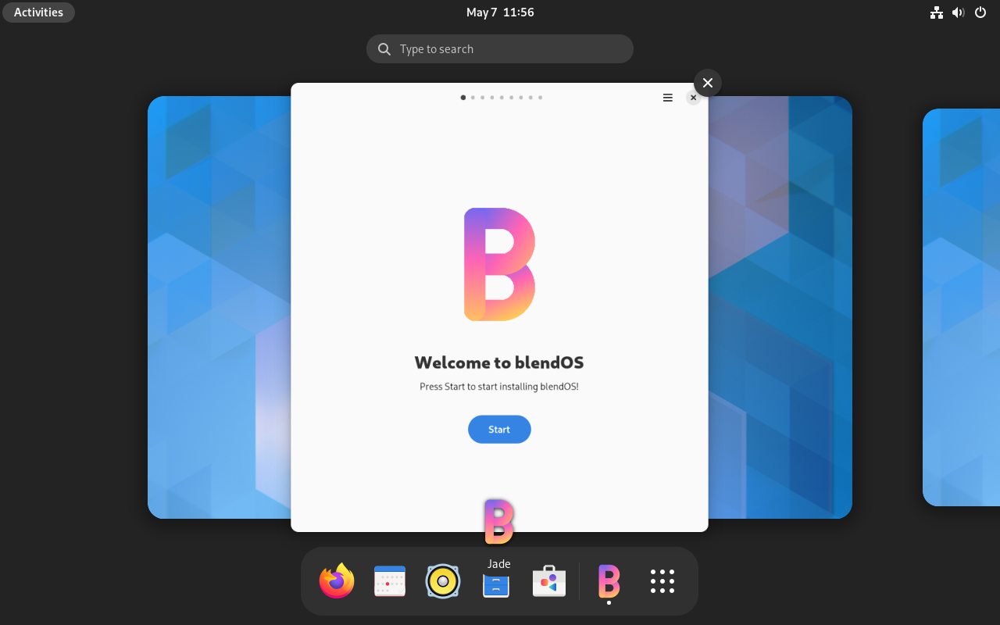

#### KDE:

The **blendOS Installer** should pop up. If it doesn't, open it from the **Application Menu** (press the Windows key) and type "installer":

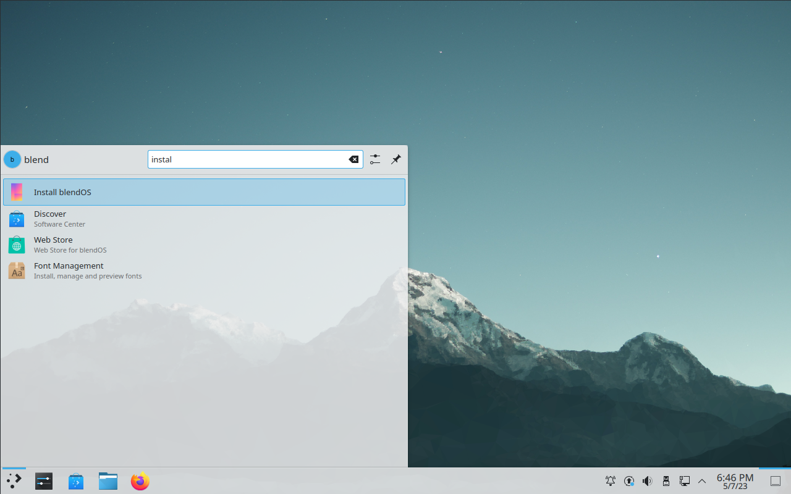

### Step 6: Running the installer

Click **Start** in the installer to begin the install process.

**1.** You'll first be asked to select a keyboard layout:

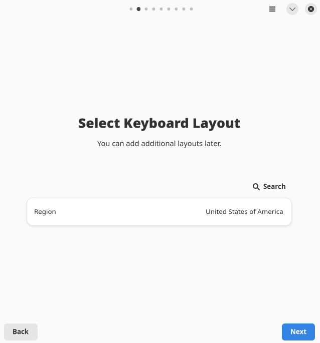

Click **Search** to choose a keyboard layout (even though it says timezone):

**2.** After choosing your keyboard layout, select your **timezone**:

Hit **Search** to see timezone options:

**3.** After you set your region, it's time to set your **locale**:

:::info
**WHAT IS A LOCALE?**

A locale is basically the thing that the system checks to set your currency, time/date layout (dd/mm/yyyy or mm/dd/yyyy) and language.

It also sets your text encoding (UTF-8 is the main one, you need at least one UTF-8 locale)

they're typed like this: `<lang>_<country_code>.<text_encoding>` (ex. `en_US.UTF8`)
:::

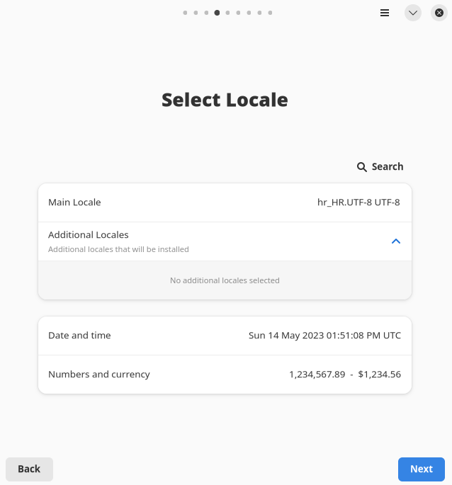

Hit **Search**, then choose a locale, and tick **Use as main locale**:

**4.** Make your **user account**:

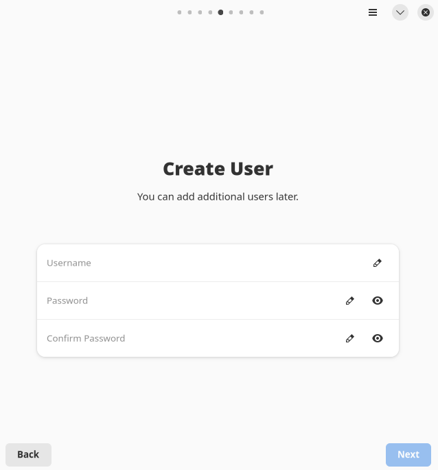

**5.** Next, choose the disk you'd like to wipe and partition, or choose [**Manual Partitioning**](#appendices):

:::danger

**WARNING!!**

THIS WILL ERASE ALL DATA ON THE SELECTED DISK!!
:::

**Manual Partitioning** (consult [Appendix A](#appendicies) for how to do this):

**6.** Then, check that everything is good in the **Summary**:

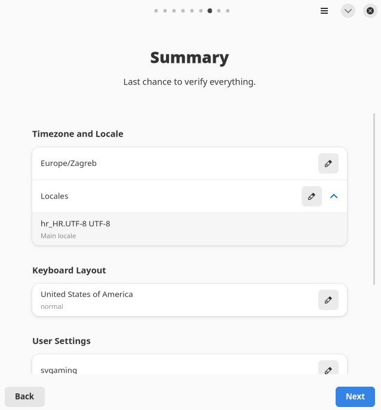

Then, hit **Next** and wait for the installer to finish:

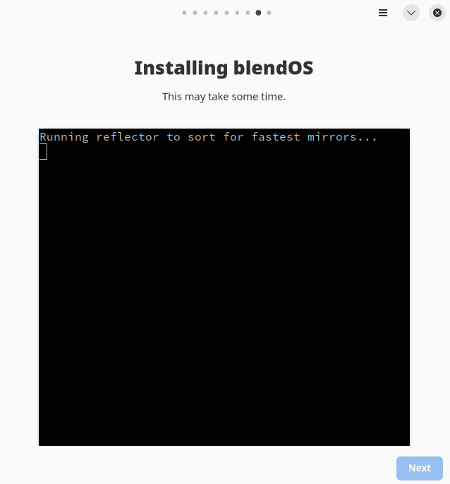

Once the installer finishes, you'll be greeted with an option to reboot:

## Post-Install

### Step 1: Updating the system

Once you reboot, you should boot off of your **hard disk**.

Once you're at the desktop open the **Terminal**

**GNOME:**

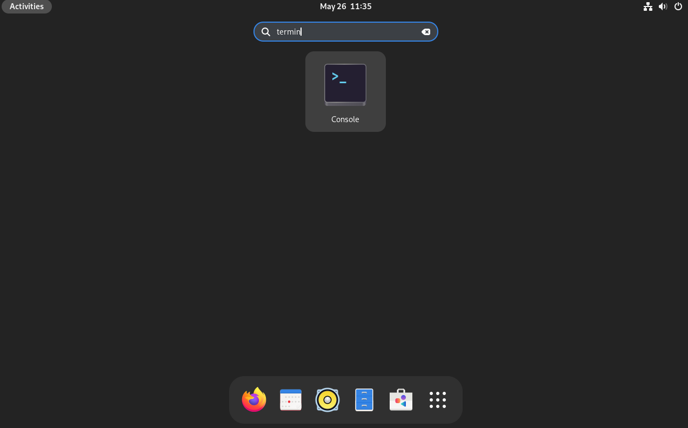

**KDE:**

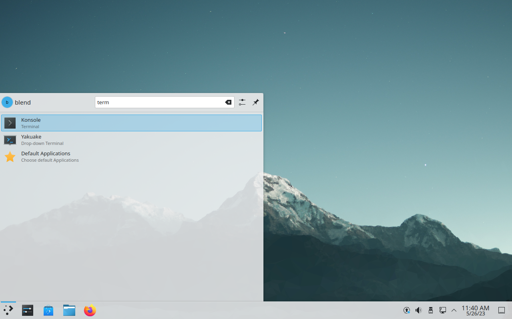

Then, type `sudo pacman -Syu` and enter your user password at the prompt.

**GNOME:**

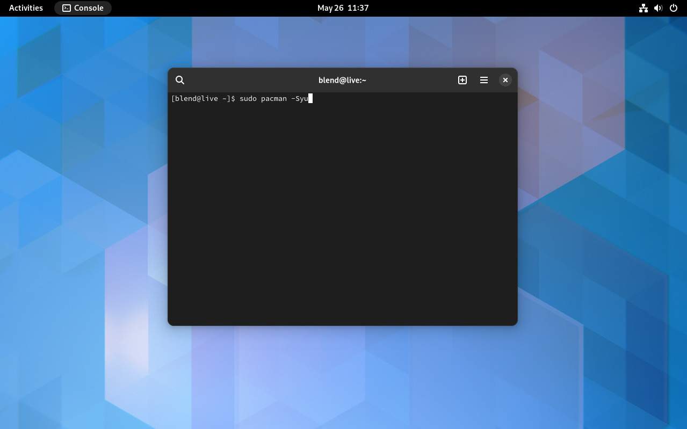

**KDE:**

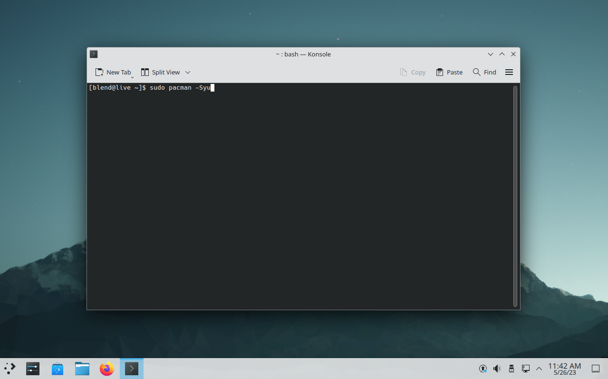

`pacman` will show the list of avalible upgrades, hit <kbd>y</kbd>:

**GNOME:**

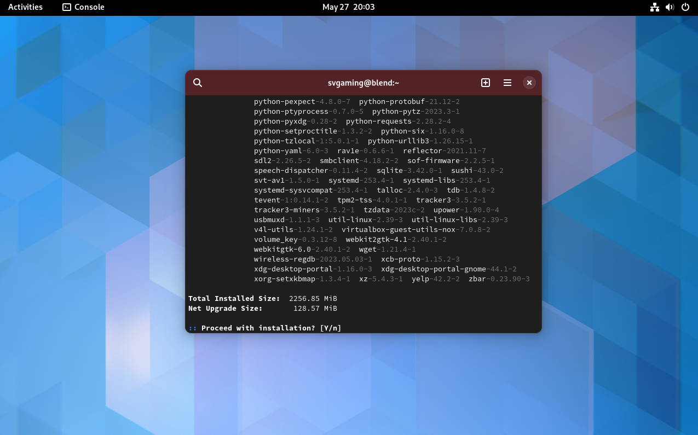

**KDE:**

It should start upgrading:

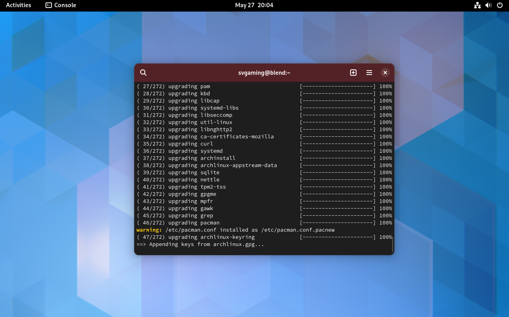

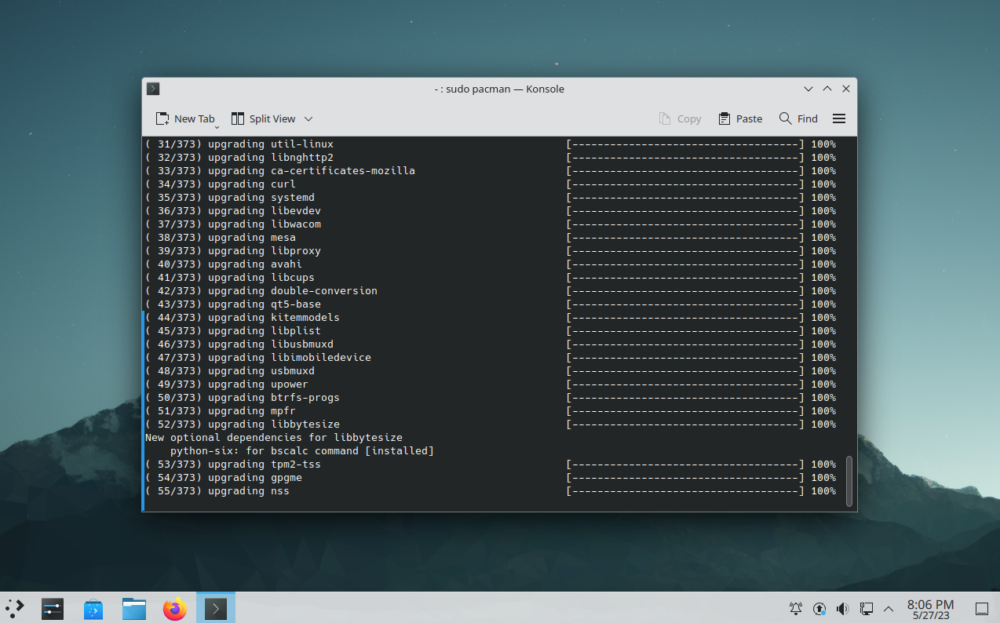

### Step 2: Installing `linux-zen` for Waydroid support

:::warning

**THIS PART IS NOT DONE YET, DO NOT FOLLOW IT!!!!**

:::

Open the **terminal** again, and type `sudo pacman -S linux-zen linux-zen-headers` (hit <kbd>y</kbd> at the prompt)

`<gnome or kde screenshot it doesn't matter (of the command)>`

Then, run: `sudo grub-mkconfig -o /boot/grub/grub.cfg` to update **GRUB** (the **GR**and **U**nified **B**ootloader)

:::tip

This is the equivalent of `update-grub` on other distros. You can install it into the host (you have to install it to the host) with `sudo pacman -S update-grub` (if it's not found there try the AUR).

:::

After both packages have installed, **reboot**. At the "Choose Boot Option" menu, choose `Advanced Options for blendOS`, then `blendos - linux-zen 6.1` (or similar).

`screenshot of grub bootmenu and then the advanced options menu`

:::danger

**MAKE SURE YOU ARE IN THE ZEN KERNEL BEFORE PROCEEDING!!**

You don't want to remove the runnning kernel. To check what kernel is running, run the following: `uname -a | grep "zen"`

With zen:

`screenshot with zen`

Without zen:

`screenshot without zen`

:::

Once you're back in the OS, install the DKMS versions of these 2 drivers: `sudo pacman -S broadcom-wl-dkms nvidia-dkms`, then remove the Linux kernel `sudo pacman -Rcns linux linux-headers`

`screenshot of the command`

**You're done!**

## Appendices

:::info

These are done, you can follow them 😉

:::

Appendix A: Manual Partitioning (UEFI)

<!-- No headers in dropdowns -->
**How to manually partition on a UEFI system:**

:::danger

If you are using VirtualBox or VMWare (or any legacy BIOS system/hypervisor) this guide is not for you, you're on your own.

:::

1. In the installer, choose **Manual Partitioning**, then **Open GParted**:

Now you should see something like this (but with your partitions):

Choose the disk you'd like to use in the upper right.

:::danger

**MAKE SURE YOU CHOOSE THE RIGHT DISK!!**

If you do not choose the correct disk, you may do unwanted damage.

The install livecd will also be shown here (as the last disk, usually `/dev/sdb` or `/dev/sdc`, it has an ISO partition and an EFI partition.)

Do not format the livecd.
:::

2. If you wish to wipe your drive go to `Device > Create Partition Table`:

:::danger

------------------ **WARNING!!** ---------------------

**THIS WILL WIPE ALL DATA AND PARTITIONS ON YOUR DRIVE!**

:::

3. For the partition table choose **GPT** (you *do* have a UEFI system, right?) (most PCs have UEFI)

1. Make a new **EFI** partition (`Partition > New` or clicking the `New` icon on the top bar):
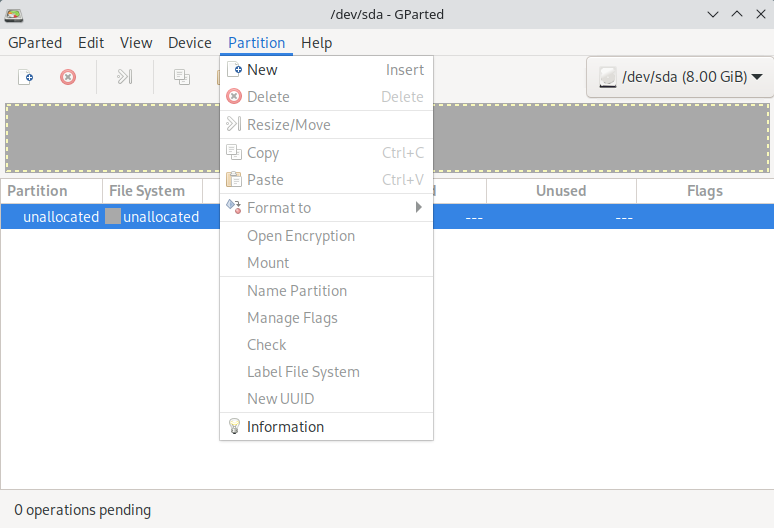

In the box, set the `New Size` to 512 and drag the partition to the left side.

Set `File System` to fat32, `Label` it what you want, and hit `Add`.

:::tip

**Changes are not saved in GParted until you hit apply**, so you can tweak all this to your liking.

:::

You should now see this:

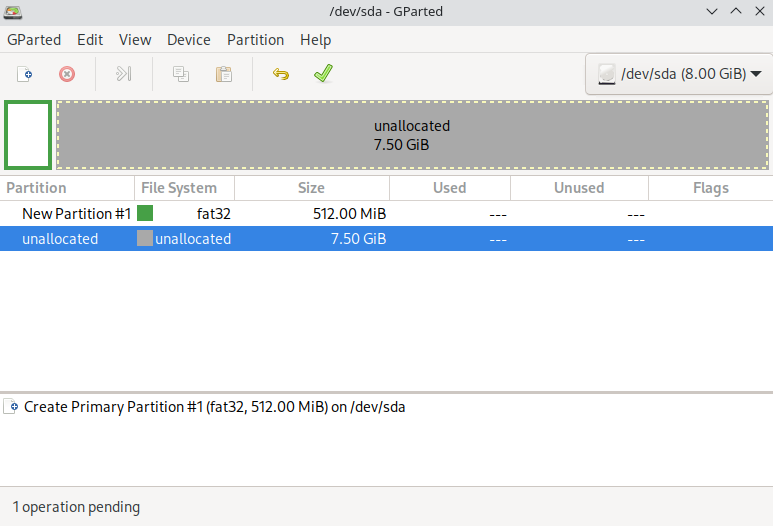

The box on the bottom shows **pending changes**, so you can see what you've done.

**NOTE:** The following step is optional, open the dropdown below to see it.

Appendix A.1: Making a swap partition

**Why would I want a swap partition?**

Swap is like memory but on your disk, useful if you have a low amount of RAM or do a lot of containerization / virtualization.
It's also helpful to have *some* swap.

<!-- you can't do headers in a dropdown -->

**Making a swap partition**

This is not your only option (you can also [**swap to a file**](https://wiki.archlinux.org/title/Swap#Swap_file) post-install), but here's how to do it:

Make a **new partition** (`Partition > New`) and set it up like the image below:

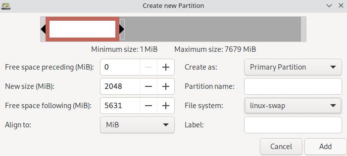

Set `File System` to `linux-swap`, size to whatever you want (1028 MB = 1 GB in this case)

:::tip

If you don't know what size your swap should be, consult the table below:

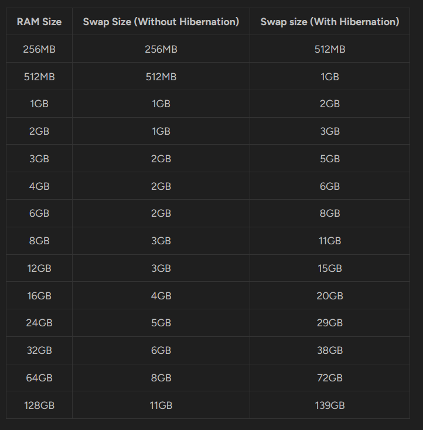

*Image taken from this [**It's FOSS article**](https://itsfoss.com/swap-size)*
:::

`Label` it what you want, and hit `Add`.

(you'll see something like this):

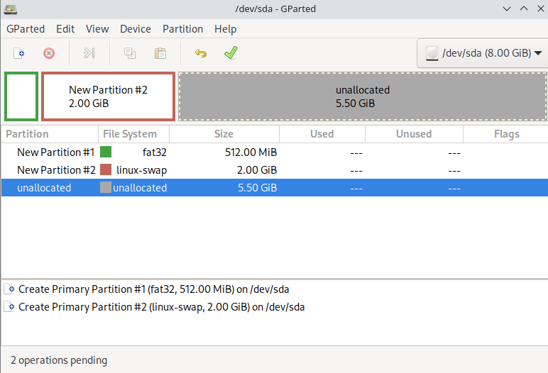

1. Make your main partition:

Make a new partition with the following settings:

* File System: `ext4`
* Space: The rest of your drive (unless you want a seperate `/home`, `/usr`, and/or `/tmp` partition)
* Label: whatever you want

6. Finalizing

Hit `Apply` (the green checkmark)

:::danger

**THIS WILL MAKE WRITE CHANGES TO YOUR DISK!!!**

Make sure that eveything is good before you proceed.

:::

Hit `Apply` again to proceed and wait for the operations to complete.

Once completed, hit `Close`.

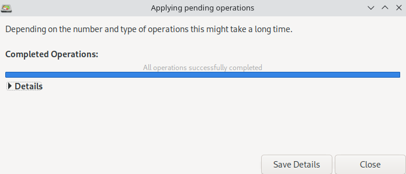

Now, go back to the **installer** (hit the refresh icon)

You should see your new partitions below:

Set the following: (open the terminal and run `lsblk` to see disks and partitions on your system)

(You may see something different, like `/dev/nvme0n1p1` for partition 1 of NVMe drive 1, but the procedure is the same)

Make sure that you pick the right disk, note down the id of the disk you used (ex. `/dev/sda`) (may also be `/dev/sdb1`, `/dev/sdc1`, etc, but the procedure is the same)

:::info

`/dev/sda3` in the table will be `/dev/sda2` for you if you didn't make a swap space.

The biggest partition should be mounted at `/` and not formatted (it's your `/dev/sda3`).

:::

| Drive     | Format? | Mount Point |
| --------- | ------- | ----------- |
| /dev/sda1 | No      | `/boot/efi` |
| /dev/sda2 | No      | None        |
| /dev/sda3 | No      | `/`         |

  

  

PluoxHost mirror provided by: [Pluox Hosting](https://pluoxhost.xyz) | 24/7 Freemium Host
