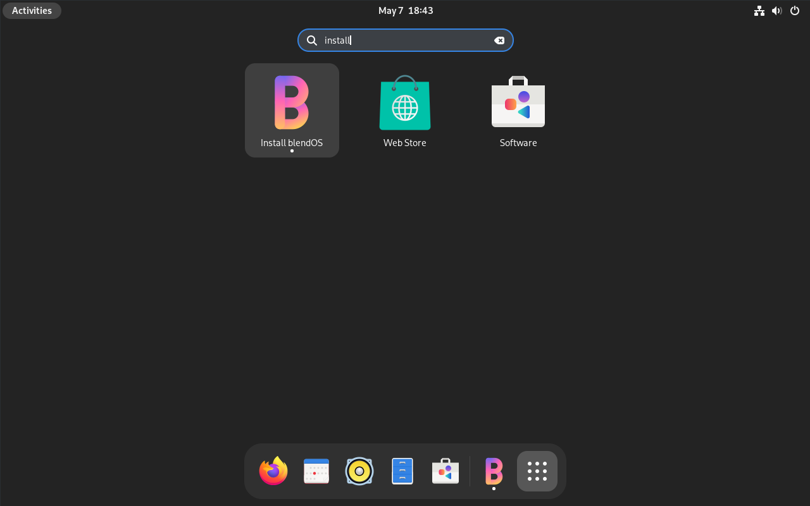
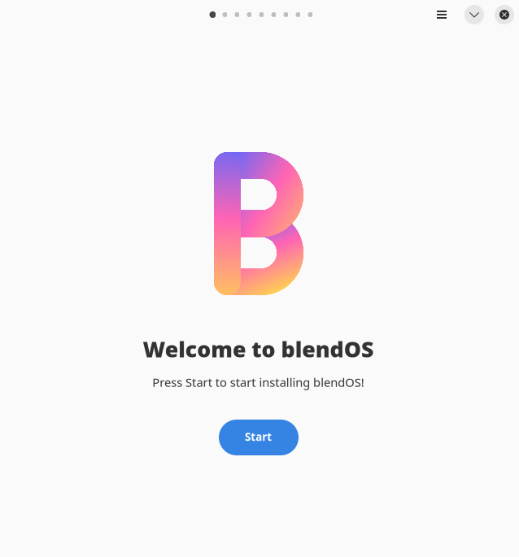
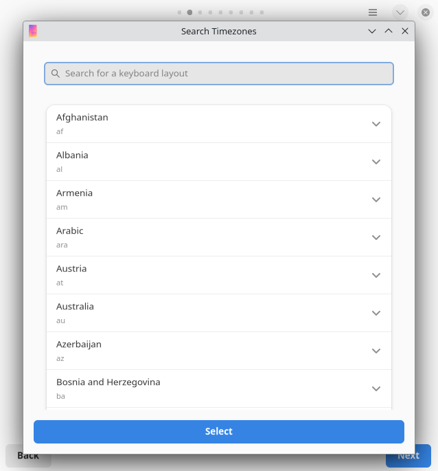
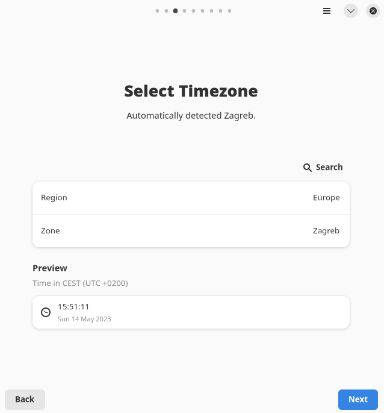
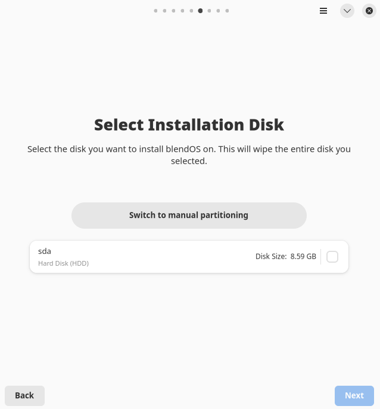
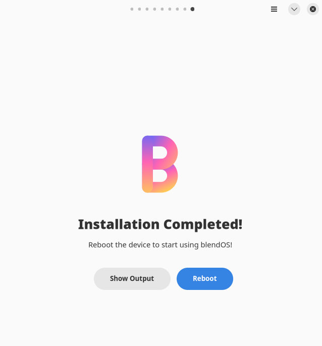
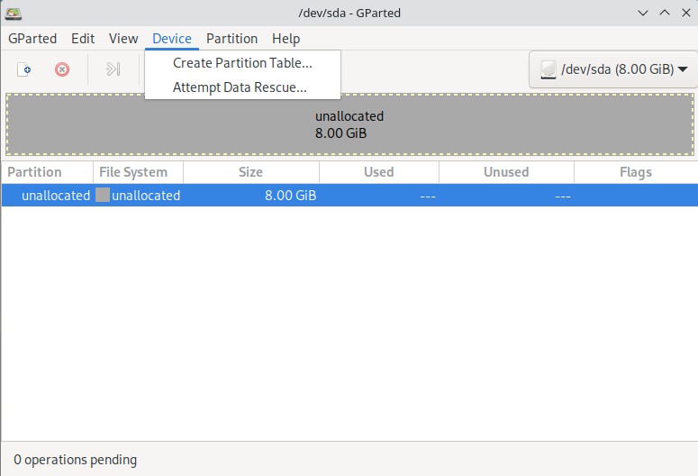

Learn how to install blendOS on your computer through this guide!

## What you'll need

* A 64-bit CPU, from no earlier than 2009.
* A minimum of 4 GBs of RAM and 25 GBs of storage.
* A spare USB drive, with a minimum size of 4GBs.

<!--truncate-->

## Installation

You can skip to a particular step from the outline on the right, if you're on a computer.

### Step 1: Download the latest blendOS ISO file

:::tip

If you're coming from Windows or macOS, it's recommended that you download the [**KDE Plasma**](https://kde.org/plasma-desktop/) edition of blendOS. It is extremely intuitive, and has a similar workflow to other operating system.

However, if you prefer a functional default layout and are open to something new, the [**GNOME**](https://www.gnome.org/) edition may be for you.
:::

1. KDE Plasma Edition:
    * ~~[Download from Google Drive (Broken ISO) (**DO NOT USE**)](https://drive.google.com/file/d/1SOTy4MCB_n_28Vm8-ZNbgxLOR9LV0ZMc/view)~~
    * [Download from SourceForge](https://sourceforge.net/projects/blendos/files/23.04-1/Plasma/blendOS-2023.04.22-x86_64-plasma.iso/download)
    * [Download from MEGA](https://mega.nz/file/2ExDkZQD#BIZ0ANkPdPMytkjqhQNaFLNca9T-BOa0DFbSYv_Y84c)
    * [Download from Asterisk's backup mirror (slow)](https://blend.shinken.studio/blendOS-2023.04.22-x86_64-plasma.iso)
    * [Download from](http://free-05.pluoxhost.xyz:3007/blendOS-2023.04.22-x86_64-plasma.iso) [**PluoxHost**](https://pluoxhost.xyz) [mirror](http://free-05.pluoxhost.xyz:3007/blendOS-2023.04.22-x86_64-plasma.iso)
2. GNOME Edition:
    * ~~[Download from Google Drive (Broken ISO) (**DO NOT USE**)](https://drive.google.com/file/d/1nT_lMZlVy2y6VVJUas1qph4I7-gxsMfB/view)~~
    * [Download from SourceForge](https://sourceforge.net/projects/blendos/files/23.04-1/GNOME/blendOS-2023.04.22-x86_64-gnome.iso/download)
    * [Download from MEGA](https://mega.nz/file/eYAkRRwR#ogEFqh7ls08cis7EqjlGFdvqELtPoxUtqG7EN6pIqCc)
    * [Download from Asterisk's backup mirror (slow)](https://blend.shinken.studio/blendOS-2023.04.22-x86_64-gnome.iso)
    * [Download from](http://free-05.pluoxhost.xyz:3007/blendOS-2023.04.22-x86_64-gnome.iso) [**PluoxHost**](https://pluoxhost.xyz) [mirror](http://free-05.pluoxhost.xyz:3007/blendOS-2023.04.22-x86_64-gnome.iso)

### Step 2: Download balenaEtcher

In this guide, we will be using balenaEtcher to burn the ISO file to the USB drive.

Regardless of whether you're currently using Linux, macOS or Windows, you can download and install balenaEtcher from [here](https://www.balena.io/etcher).

### Step 3: Burn the ISO to your USB drive

:::danger

Make sure to select the correct USB drive, as balenaEtcher will **erase** ALL THE FILES on the drive.

:::

Click on **Flash from file**, and select the ISO file you downloaded earlier. You can then select the USB drive you would like to flash the ISO drive to. After
selecting the drive, you can click on **Flash** to flash/burn the ISO to the USB drive.

### Step 4: Boot from the USB drive

:::info

The computer you used to flash the ISO file to the USB drive may be the same as the computer you want to install blendOS.

:::

Insert the USB drive into the computer that you wish to install blendOS to, and power it off. After a few seconds, power it on and hold the <kbd>F12</kbd> until you arrive at your computer's boot menu. If that doesn't work, you may also try <kbd>F10</kbd>, <kbd>Esc</kbd>, or <kbd>F2</kbd>.

Once at the boot menu, select the USB drive you flashed blendOS to. You will be greeted by another menu, where you can press <kbd>Enter</kbd> to proceed with booting the live installation media.

### Step 5: Installing

:::info

You may see some flashing text come up during boot, it's normal! (Just a Linux thing)

:::

You should arrive at the **desktop**, which should look like this:

#### GNOME:

#### KDE:

The **blendOS Installer** should pop up. If it doesn't, open it from the **Application Menu** (press the Windows key) and type "installer":

#### Install Steps:

Click **Start** in the installer to begin the install process.

**1.** You'll first be asked to select a keyboard layout:

Click **Search** to choose a keyboard layout (even though it says timezone):

**2.** After choosing your keyboard layout, select your **timezone**:

Hit **Search** to see timezone options:

**3.** After you set your region, it's time to set your **locale**:

:::info
**WHAT IS A LOCALE?**

A locale is basically the thing that the system checks to set your currency, time/date layout (dd/mm/yyyy or mm/dd/yyyy) and language.

It also sets your text encoding (UTF-8 is the main one, you need at least one UTF-8 locale)

they're typed like this: `<lang>_<country_code>.<text_encoding>` (ex. `en_US.UTF8`)
:::

Hit **Search**, then choose a locale, and tick **Use as main locale**:

**4.** Make your **user account**:

**5.** Next, choose the disk you'd like to wipe and partition, or choose **Manual Partitioning**:

:::danger

**WARNING!!**

THIS WILL ERASE ALL DATA ON THE SELECTED DISK!!
:::

**Manual Partitioning** (consult [Appendix A](/guides/installation-guide#appendicies) for how to do this):

Then, check that everything is good in the **Summary**:

Then, hit **Next** and wait for the installer to finish:

Once the installer finishes, you'll be greeted with an option to reboot:

## Appendices

Appendix A: Manual Partitioning

How to manually partition:

1. In the installer, choose **Manual Partitioning**, then **Open GParted**:

Now you should see something like this (but with your partitions):

Choose the disk you'd like to use in the upper right.

2. If you wish to wipe your drive go to `Device > Create Partition Table`:

:::danger

------------------ **WARNING!!** ---------------------

**THIS WILL WIPE ALL DATA AND PARTITIONS ON YOUR DRIVE!**

:::

3. For the partition table type:

* Choose **GPT** if you have a **UEFI** system (if you don't know, do this)
* Choose **MBR** if you have a **BIOS** system (like in a VMWare or VirtualBox VM) (max 4 partitions)

4. Make a new partition (`Partition > New` or clicking the `New` icon on the top bar):

